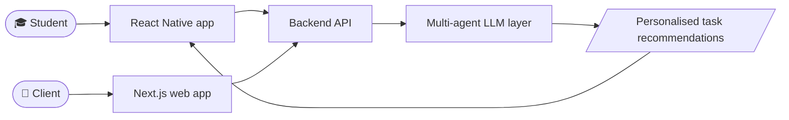
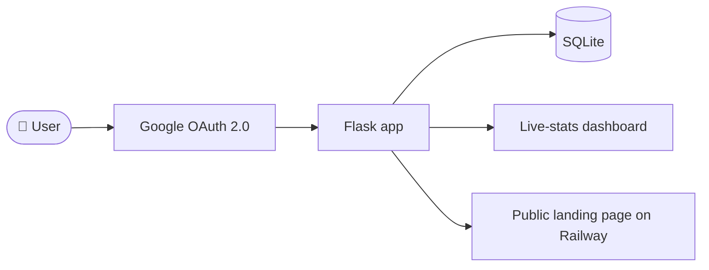

<!-- ============================ HEADER ============================ -->

 

  

[**About**](#-about) &nbsp;·&nbsp; [**Stack**](#-tech-stack) &nbsp;·&nbsp; [**Projects**](#-featured-projects) &nbsp;·&nbsp; [**Stats**](#-github-analytics) &nbsp;·&nbsp; [**Contact**](#-lets-connect)

 

<!-- ============================= ABOUT ============================= -->
## 👋 About

> [!NOTE]
> BSc (Hons) Software Engineering undergraduate at **SLTC Research University**. I build products with a focus on **clean architecture, REST APIs and secure authentication**, and I like problems that touch real people: student safety, logistics, job hunting, everyday shopping.

<table>
<tr>
<td width="50%" valign="top">

### 🔭 Right now
- 🤖 Multi-agent **LLM backends** and personalised recommendation engines
- 📍 **Geofencing** and GPS-based verification for location-aware features
- 📱 Full-stack web + cross-platform mobile apps
- 🔐 **OAuth 2.0** flows and secure session handling

</td>
<td width="50%" valign="top">

### 🎯 What I'm aiming for
- Land an **internship** in software engineering
- Ship reliable, scalable products end to end
- Grow in AI-powered systems and backend architecture
- Collaborate on projects that solve real problems

</td>
</tr>
</table>

 

<!-- =========================== TECH STACK ========================== -->
## 🧰 Tech Stack

<table>
<tr>
<td width="22%"><b>Languages</b></td>
<td>
<picture>
  <source media="(prefers-color-scheme: dark)" srcset="https://skillicons.dev/icons?i=python,js,java,html,css&theme=dark">
  
</picture>
</td>
</tr>
<tr>
<td><b>Frontend & Mobile</b></td>
<td>
<picture>
  <source media="(prefers-color-scheme: dark)" srcset="https://skillicons.dev/icons?i=react,nextjs,androidstudio&theme=dark">
  
</picture>

</td>
</tr>
<tr>
<td><b>Backend & Data</b></td>
<td>
<picture>
  <source media="(prefers-color-scheme: dark)" srcset="https://skillicons.dev/icons?i=flask,sqlite,firebase&theme=dark">
  
</picture>

</td>
</tr>
<tr>
<td><b>AI & Embedded</b></td>
<td>
<picture>
  <source media="(prefers-color-scheme: dark)" srcset="https://skillicons.dev/icons?i=arduino&theme=dark">
  
</picture>

</td>
</tr>
<tr>
<td><b>Tools & Deploy</b></td>
<td>
<picture>
  <source media="(prefers-color-scheme: dark)" srcset="https://skillicons.dev/icons?i=git,github,vscode,vercel&theme=dark">
  
</picture>

</td>
</tr>
</table>

 

<!-- ============================ PROJECTS =========================== -->
## 🚀 Featured Projects

<table>
<tr>
<td width="50%" valign="top">

### 🎓 UniWork Sri Lanka
**Micro-gig marketplace** that connects university students with corporate clients. A multi-agent LLM backend personalises task recommendations for each student.

`Next.js` `React` `React Native` `Multi-agent LLM`

</td>
<td width="50%" valign="top">

### 📋 ApplyTrack
**Internship application tracker** with Google OAuth 2.0 sign-in, a live-stats dashboard and a deployed public landing page.

`Python` `Flask` `SQLite` `OAuth 2.0` `Railway`

</td>
</tr>
<tr>
<td width="50%" valign="top">

### 🛒 LankaSmartMart
**Online supermarket app** with product browsing, cart management and order tracking.

`Java` `Android` `Firebase`

</td>
<td width="50%" valign="top">

### 🤖 Smart Mimo
**AI-assisted study robot** that combines hardware control with interactive learning support.

`Python` `Embedded Systems`

</td>
</tr>
</table>

<b>🧩 How UniWork and ApplyTrack fit together (architecture sketches)</b>

 

**UniWork Sri Lanka**

**ApplyTrack**

  

  
  

 

<!-- ============================ ANALYTICS ========================== -->
## 📊 GitHub Analytics

  
  

  

  

<!-- Snake: needs .github/workflows/snake.yml (included) to run once, then this image appears -->

  <picture>
    <source media="(prefers-color-scheme: dark)" srcset="https://raw.githubusercontent.com/pramilacz/pramilacz/output/github-snake-dark.svg" />
    <source media="(prefers-color-scheme: light)" srcset="https://raw.githubusercontent.com/pramilacz/pramilacz/output/github-snake.svg" />
    
  </picture>

 

<!-- ============================= CONTACT =========================== -->
## 🤝 Let's Connect

> [!TIP]
> I'm actively looking for **software engineering internship opportunities** and happy to collaborate on interesting projects. Reach out any time.

  
  
  

<i>The best software isn't just functional. It's the one that quietly solves a real problem for real people.</i>

